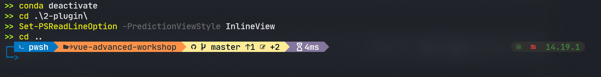

# posh-maybe-10k
A theme based on oh-my-posh, powerline10k, omp-atomic and omp-kail.

# Features
> many icons from the theme atomic from oh-my-posh
> transient prompt look like powerlevel10k
# Prerequisites
* Windows 

-> if you are using Mac or Linux you can easily use powerlevel10k from the [link](https://github.com/romkatv/powerlevel10k).
* powershell 7.0+

-> how to install powershell 7?
[install-powershell](https://docs.microsoft.com/en-us/shows/it-ops-talk/how-to-install-powershell-7)
* Nerd Font Family

-> how to use nerd font?
follow the [link](https://www.nerdfonts.com/) and choose a Nerd Font you like to download.
unzip the file and copy all \*.ttf type files to C:/Windows/Fonts to install or right click and choose install to install it.
* posh-git & oh-my-posh

-> how to install posh-git & oh-my-posh
open your powershell and copy these lines below.
```sh
Install-Module posh-git
Install-Module oh-my-posh
```
# Installation
clone the file and drop it into the correct folder:
```sh
git clone https://github.com/qwqqaqqwq00/posh-maybe-10k.git
cd ./posh-maybe-10k
mv ./my-atomic.omp.json ${OMP_PATH}/themes/my-atomic.omp.json
```
in powershell use `$Profile` to check your profile and open it then add these lines below.
```sh
# set your theme.
Set-PoshPrompt -Theme my-atomic
Set-Alias p pnpm
Set-Alias px pnpx
Set-Alias ms multipass

# enable transient prompt
Set-PSReadlineOption -ExtraPromptLineCount 1
Enable-PoshTransientPrompt
```
then save your profile and close it, finally, open your powershell to check.
# Acknowledgments
* [powerlevel10k](https://github.com/romkatv/powerlevel10k)
* [oh-my-posh](https://github.com/JanDeDobbeleer/oh-my-posh3)
* [Nerd Fonts](https://www.nerdfonts.com/)
